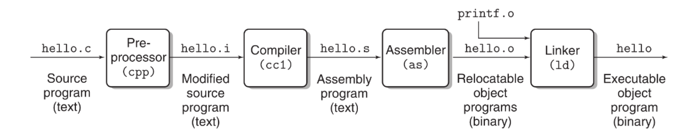
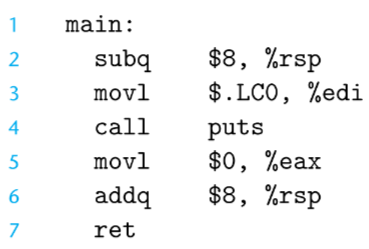

## hello.c Program
Before anything else let me tell you what this hello.c file contains so that it won't act as a mystery for you folks while we dive deeper into the inner workings of compilation.

The contents of hello.c program file are as simple as it can be. I just do the following things in the code;
- Importing the `Header File`.
- The beginning of `main()` function.
- Printing `Hello World \n` in terminal.

The code is as follows;
```
#include<stdio.h>
int main(){
    printf("Hello World \n");
    return 0;
}
```
Now that this is out of the way let's dig in the different phases of the compilation system and see what each phase does to this hello.c file.

---
---
## The Compilation System
A compilation system is basically a set of sub-programs which run in background as soon as the compilation starts. The goal is to convert the high level C language code to a low level machine readable format so that the processor can do it's job and the programmer can see the desired output in the terminal.

The following image will help you a lot in order to understand what is the actual flow of format conversion from the beginning to end for a `.c` file.



## Phases in the Compilation

### 1. Preprocessor(cpp) : `hello.c -> hello.i`
As you can see in the hello.c program above, the first thing we do is that we include a header file in the code. Now when we go ahead to compile this program we have to know the contents of the header file which we just included otherwise what's even the point of including it in the first place right?

This exact task is done by the proprocessor. It goes and loads the content of the header file on top of the hello.c file.

The result is a modified file with `.i` extension so now we have `hello.i`.

### 2. Compiler(cc1) : `hello.i -> hello.s`
The task of the compiler is to translate the contents of `hello.i` file to `hello.s` file which contains the Assembly-Language Program. This program includes the following definition of function `main()`;



Assembly-Language is usefull because it provides a common output language for different compilers.
For Example : The compilers of C and Fortran, both generate output files in the same assembly language.

### 3. Assembler(as) : `hello.s -> hello.o`
Next the assembler(as) converts the `hello.s` file to `hello.o` file which contains the low level machine-language instructions. It packages them in a form known as `Relocatable Object Program` and stores the result in an object file called `hello.o`. This file is a binary file typically containing 17 bytes to represent the main() function but this size depends on various parameters such as the architecture of the system, the level of optimization, the compiler being used.

### 4. Linker(ld) : `hello.o -> hello`
Notice that our hello program calls the printf function, which is part of the standard C library provided by every C compiler. The printf function resides in a separate precompiled object file called `printf.o`, which must somehow be merged with our hello.o program. The `linker (ld) handles this merging`. 

The result is the `hello` file which is an `executable` object file (or simply an executable).
This executable is what the processor uses to start the execution of the program. This file gets loaded into the main memory at time of execution from where the processor accesses it and gives us the desired output.

---
---
### Summary:
It pays off to know about the life-cycle of a program because when you know the actual flow of imformation within the system then you're perfectly suited for writing better and optimized code in comparison to other programmers.

I hope this was a satisfactory explaination for you folks...
I'll see you in the next one ;)